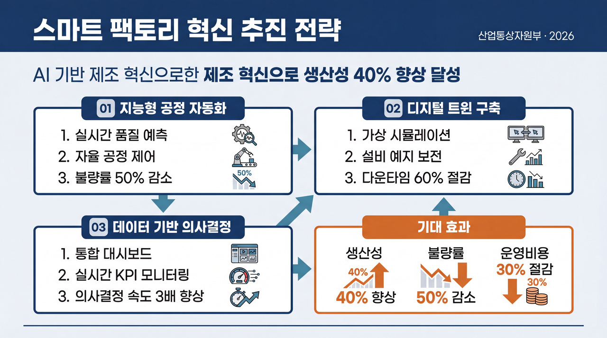
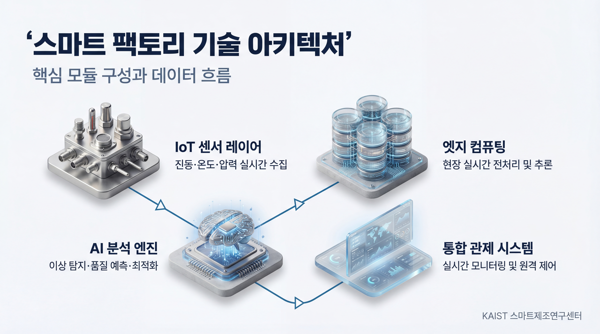
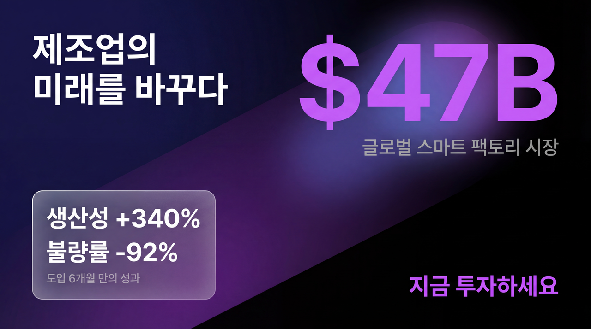
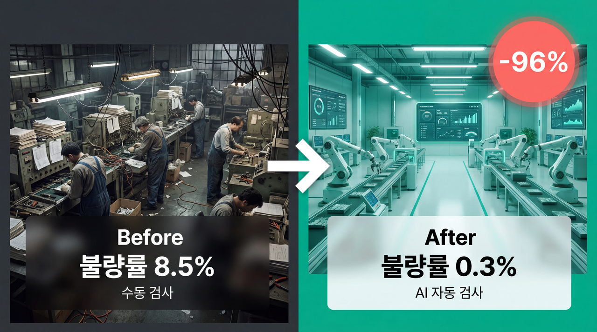

# Honeypot

> Claude Code 플러그인 마켓플레이스 — ISD 연구계획서, 시각자료, 논문 스타일, 연금 포트폴리오 분석, 주식 상담, HWPX 문서 생성

**Version**: 2.2.0  
**Author**: [Baekdong Cha](https://github.com/orientpine)  
**License**: MIT

---

## 주요 기능

| 플러그인 | 설명 | 유형 |
|----------|------|:----:|
| **isd-generator** | ISD 연구계획서 전체 생성 (5개 Chapter + 이미지) | Agent+Command+Skill |
| **visual-generator** | Kurzgesagt/Gov/Seminar/WhatIf/Pitch/Comparison 테마 시각자료 생성 + Gemini 렌더링 | Agent+Command+Skill |
| **paper-style-generator** | PDF 논문 분석 → 논문 작성 스킬 세트 자동 생성 (메타-플러그인) | Agent+Command+Skill |
| **report-generator** | 연구 노트 → 국가기관 제출용 연구 보고서 자동 생성 | Agent+Command+Skill |
| **investments-portfolio** | DC 연금 포트폴리오 분석 멀티 에이전트 시스템 | Agent+Command+Skill |
| **stock-consultation** | 주식/ETF 투자 상담 Multi-Agent. Bogle/Vanguard 철학 기반. | Agent+Command+Skill |
| **hwpx-generator** | HWPX 문서 생성/편집/분석 통합 플러그인. XML-first 빌드 + ZIP 치환. | Agent+Command+Skill |
| **macro-analysis** | 거시경제 분석 공용 에이전트 (지수/금리/섹터/리스크/리더십/종합/검증) | Agent |
| **general-agents** | 범용 에이전트 (인터뷰 등) | Agent |
| **equity-research** | 기관급 주식 분석 리포트 생성 | Agent |
| **worktree-workflow** | Git worktree를 활용한 Claude Code 병렬 실행 워크플로우 | Agent |

---

## 빠른 시작

### 1. 마켓플레이스 등록

```bash
# Claude Code에서 실행
/plugin marketplace add /path/to/honeypot
```

### 2. 플러그인 사용

```bash
# 예: ISD 연구계획서 생성
@isd-generator 오케스트레이터를 사용해서 연구계획서를 생성해줘

# 예: DC 연금 포트폴리오 분석
@investments-portfolio 포트폴리오 분석을 시작해줘

# 예: 시각자료 생성
@visual-generator 발표 자료를 만들어줘
```

---

## 프로젝트 구조

```
honeypot/
├── .claude-plugin/
│   └── marketplace.json              # 마켓플레이스 레지스트리 (11개 플러그인)
├── plugins/
│   ├── isd-generator/                # ISD 연구계획서 생성
│   │   ├── agents/                   # 6 agents (chapter1-5, figure)
│   │   ├── commands/                 # isd-generate (오케스트레이터)
│   │   └── skills/                   # 11 skills (chapter guides, core-resources 등)
│   ├── visual-generator/             # 시각자료 생성
│   │   ├── agents/                   # 4 agents (content-organizer, content-reviewer, prompt-designer, renderer-agent)
│   │   ├── commands/                 # visual-generate (오케스트레이터)
│   │   └── skills/                   # 8 skills (layout-types, theme-*, slide-renderer)
│   ├── paper-style-generator/        # 논문 스타일 스킬 생성
│   │   ├── agents/                   # 3 agents (pdf-converter, style-analyzer, skill-generator)
│   │   ├── commands/                 # paper-style-generate (오케스트레이터)
│   │   └── skills/                   # 1 skill (paper-style-toolkit)
│   ├── report-generator/             # 연구 보고서 생성
│   │   ├── agents/                   # 4 agents (input-analyzer, content-mapper, chapter-writer, quality-checker)
│   │   ├── commands/                 # report-generate (오케스트레이터)
│   │   └── skills/                   # 3 skills (chapter-structure, field-keywords, four-step-pattern)
│   ├── investments-portfolio/        # DC 연금 포트폴리오
│   │   ├── agents/                   # 4 agents (fund-portfolio, compliance-checker, output-critic, material-organizer)
│   │   ├── commands/                 # portfolio-analyze (오케스트레이터)
│   │   └── skills/                   # 11 skills (bogle-principles, dc-pension-rules 등)
│   ├── stock-consultation/           # 주식/ETF 투자 상담
│   │   ├── agents/                   # 5 agents (materials-organizer, stock-screener, stock-valuation, bear-case-critic, stock-critic)
│   │   ├── commands/                 # stock-consult (오케스트레이터)
│   │   └── skills/                   # 3 skills (analyst-common-stock, file-save-protocol-stock, stock-data-verifier)
│   ├── hwpx-generator/               # HWPX 문서 생성/편집/분석
│   │   ├── agents/                   # 2 agents (hwpx-builder, hwpx-analyzer)
│   │   ├── commands/                 # hwpx-generate (오케스트레이터)
│   │   └── skills/                   # 2 skills (hwpx-core, hwpx-templates)
│   ├── macro-analysis/               # 거시경제 분석 공용 에이전트
│   │   └── agents/                   # 7 agents (index-fetcher, rate-analyst, sector-analyst, risk-analyst, leadership-analyst, macro-synthesizer, macro-critic)
│   ├── general-agents/               # 범용 에이전트
│   │   └── agents/                   # 1 agent (interview)
│   ├── equity-research/              # 기관급 주식 분석
│   │   └── agents/                   # 1 agent (equity-research-analyst)
│   └── worktree-workflow/            # Git worktree 워크플로우
│       └── agents/                   # 1 agent (worktree)
├── AGENTS.md                         # 프로젝트 상세 지식 베이스
└── README.md                         # 이 문서
```

---

## 플러그인 상세

### isd-generator

**ISD (기업부설연구소) 연구계획서 자동 생성**

- **워크플로우**: Chapter 3 → 1 → 2 → 4 → 5 순서로 생성
- **오케스트레이터**: `commands/isd-generate.md`
- **출력**: `output/[프로젝트명]/chapter_{1-5}/`
- **이미지 생성**: Gemini API로 캡션 기반 이미지 자동 생성

| 구성 | 항목 |
|------|------|
| Agents (6) | chapter1, chapter2, chapter3, chapter4, chapter5, figure |
| Command (1) | isd-generate (오케스트레이터) |
| Skills (11) | chapter1~5-guide, core-resources, data-collection-guide, figure-guide, image-reference-guide, input-template, verification-rules |

### visual-generator

**시각자료 프롬프트 생성 및 렌더링 (6개 테마 + 레이아웃)**

동일한 주제(스마트 팩토리)를 6개 테마로 시각화한 예시:

#### theme-concept — Kurzgesagt 풍 시각 스토리텔링

> 텍스트 없이 장면과 시각적 메타포만으로 개념을 전달하는 교육용 일러스트레이션

<p align="center">
  
</p>

#### theme-gov — 정부/공공기관 PPT

> 굵은 테두리 박스에 번호가 매겨진 체계적 격자. 공식 문서 톤.

<p align="center">
  
</p>

#### theme-seminar — 세미나/학술 발표

> 에디토리얼 매거진 × 아이소메트릭 3D. 포토리얼리스틱 3D 아이콘과 다이나믹 타이포그래피.

<p align="center">
  
</p>

#### theme-whatif — 미래 비전 스냅샷

> 공상과학 영화 UI처럼 빛나는 HUD. 이미 성공한 미래 안에 서 있는 느낌.

<p align="center">
  
</p>

#### theme-pitch — 피치덱

> Apple 키노트처럼 어두운 그래디언트 위의 거대한 숫자와 프로스티드 글래스 카드.

<p align="center">
  
</p>

#### theme-comparison — Before/After 비교

> IMAX 분할 화면처럼 좌우 풀블리드 이미지 위에 핵심 수치가 떠 있다.

<p align="center">
  
</p>

| 구성 | 항목 |
|------|------|
| Agents (4) | content-organizer, content-reviewer, prompt-designer, renderer-agent |
| Command (1) | visual-generate (오케스트레이터) |
| Skills (8) | layout-types, theme-concept, theme-gov, theme-seminar, theme-whatif, theme-pitch, theme-comparison, slide-renderer |

### paper-style-generator

**PDF 논문 → 논문 작성 스킬 세트 생성 (메타-플러그인)**

1. MinerU로 PDF → Markdown 변환
2. 스타일 패턴 추출 (Voice, Tense, 전환어 등)
3. 10개 독립 스킬 세트 생성:
   - `{name}-common`, `{name}-abstract`, `{name}-introduction`
   - `{name}-methodology`, `{name}-results`, `{name}-discussion`
   - `{name}-caption`, `{name}-title`, `{name}-verify`
   - `{name}-orchestrator` (전체 논문 자동 생성)

| 구성 | 항목 |
|------|------|
| Agents (3) | pdf-converter, style-analyzer, skill-generator |
| Command (1) | paper-style-generate (오케스트레이터) |
| Skills (1) | paper-style-toolkit (스크립트, 템플릿, 참조자료) |

### report-generator

**연구 노트 → 국가기관 제출용 연구 보고서 생성**

- **입력**: 폴더, 파일, 코드베이스
- **출력**: 최대 9개 챕터 전문 보고서
- **문장 패턴**: 4단계 패턴 적용 (What → Why → How → Impact)

| 구성 | 항목 |
|------|------|
| Agents (4) | input-analyzer, content-mapper, chapter-writer, quality-checker |
| Command (1) | report-generate (오케스트레이터) |
| Skills (3) | chapter-structure, field-keywords, four-step-pattern |

### investments-portfolio

**DC형 퇴직연금 포트폴리오 분석 멀티 에이전트 시스템**

| Agent Group | Agents | 역할 |
|-------------|--------|------|
| Macro Analysis (macro-analysis) | index-fetcher, rate-analyst, sector-analyst, risk-analyst, leadership-analyst | 거시경제 분석 |
| Synthesizers (macro-analysis) | macro-synthesizer, macro-critic | 분석 종합 및 검증 |
| Portfolio (investments-portfolio) | fund-portfolio, compliance-checker | 펀드 추천 및 규제 검증 |
| Verification | output-critic, material-organizer | 출력 검증 및 자료 정리 |

| 구성 | 항목 |
|------|------|
| Agents (4) | fund-portfolio, compliance-checker, output-critic, material-organizer |
| Command (1) | portfolio-analyze (오케스트레이터) |
| Skills (11) | analyst-common, bogle-principles, data-updater, dc-pension-rules, devil-advocate, file-save-protocol, fund-output-template, fund-selection-criteria, macro-output-template, perspective-balance, web-search-verifier |

### stock-consultation

**주식/ETF 투자 상담 Multi-Agent 시스템 (Bogle/Vanguard 철학 기반)**

- **워크플로우**: 거시경제 분석 → 종목 스크리닝 → 밸류에이션 → 반대 논거 → 최종 검증

| 구성 | 항목 |
|------|------|
| Agents (5) | materials-organizer, stock-screener, stock-valuation, bear-case-critic, stock-critic |
| Command (1) | stock-consult (오케스트레이터) |
| Skills (3) | analyst-common-stock, file-save-protocol-stock, stock-data-verifier |

### hwpx-generator

**HWPX 문서 생성/편집/분석 통합 플러그인**

- **방식**: XML-first 빌드 + ZIP 치환
- `build_hwpx.py` 기반 생성, `fix_namespaces.py` 필수

| 구성 | 항목 |
|------|------|
| Agents (2) | hwpx-builder, hwpx-analyzer |
| Command (1) | hwpx-generate (오케스트레이터) |
| Skills (2) | hwpx-core, hwpx-templates |

### macro-analysis

**거시경제 분석 공용 에이전트 모음**

investments-portfolio, stock-consultation 등에서 공유하는 거시경제 분석 에이전트 7종.

| Agent | 역할 |
|-------|------|
| index-fetcher | 주요 지수 데이터 수집 |
| rate-analyst | 금리 분석 |
| sector-analyst | 섹터 분석 |
| risk-analyst | 리스크 분석 |
| leadership-analyst | 리더십/정책 분석 |
| macro-synthesizer | 분석 종합 |
| macro-critic | 분석 검증 |

### equity-research

**기관급 주식 분석 리포트 생성**

티커와 함께 호출하면 기관급(institutional-grade) 주식 분석 리포트를 생성합니다.

### general-agents

**범용 에이전트 모음**

- interview: 심층 인터뷰 + 실행 에이전트

### worktree-workflow

**Git worktree 기반 병렬 실행 워크플로우**

Git worktree를 활용하여 Claude Code 인스턴스를 병렬로 실행하는 워크플로우.

---

## Submodule 사용법

이 저장소를 다른 프로젝트의 하위 디렉토리로 추가하여 사용할 수 있습니다.

### Submodule 추가

```bash
cd your-project
git submodule add https://github.com/orientpine/honeypot.git honeypot
git commit -m "Add honeypot as submodule"
```

### Submodule 클론

```bash
# 방법 A: 처음부터 submodule과 함께
git clone --recurse-submodules https://github.com/username/your-project.git

# 방법 B: 이미 클론 후 초기화
git submodule update --init --recursive
```

### Submodule 업데이트

```bash
# 최신 버전으로 업데이트
git submodule update --remote --merge

# 메인 프로젝트에 반영 (필수!)
git add honeypot
git commit -m "Update honeypot submodule"
git push
```

### 자주 사용하는 명령어

| 명령어 | 설명 |
|--------|------|
| `git submodule status` | 상태 확인 |
| `git submodule update --init --recursive` | 초기화 |
| `git submodule update --remote --merge` | 최신화 |
| `git diff --submodule` | 변경사항 확인 |

### 전역 설정 (권장)

```bash
# 앞으로 git 작업 시 submodule 자동 업데이트
git config --global submodule.recurse true
```

---

## 개발 가이드

### 플러그인 표준 구조

```
plugins/{plugin-name}/
├── .claude-plugin/
│   └── plugin.json          # 플러그인 메타데이터
├── agents/                  # 에이전트 .md 파일
├── commands/                # 커맨드(워크플로우) .md 파일
└── skills/                  # 스킬 폴더 (각 스킬은 하위 디렉토리)
    └── {skill-name}/
        ├── SKILL.md         # 스킬 정의 (필수)
        ├── references/      # 참조 문서
        ├── assets/          # 템플릿, 리소스
        └── scripts/         # 실행 스크립트
```

> `scripts/`, `references/`, `assets/`는 반드시 **스킬 폴더 내부**에 위치해야 합니다 (플러그인 루트 금지).

### 새 플러그인 추가 시

1. `plugins/{plugin-name}/` 디렉토리 생성
2. `.claude-plugin/plugin.json` 생성
3. `agents/`, `commands/`, `skills/` 하위에 `.md` 파일 작성
4. `.claude-plugin/marketplace.json`에 플러그인 등록
5. 캐시 클리어 후 재등록

### 주의사항

- marketplace.json은 **루트에 하나만** 유지
- 모든 `.md` 파일은 **LF 줄바꿈** 사용
- description에 특수문자 포함 시 **큰따옴표**로 감싸기
- Agent/Skill 파일 추가/삭제 시 **marketplace.json 동기화 필수**
- 플러그인 수정 시 **plugin.json + marketplace.json 버전 동시 업데이트**

상세 개발 가이드는 [AGENTS.md](./AGENTS.md) 참조

---

## 참고 링크

- [Agent Skills Specification](https://agentskills.io/specification)
- [Git Submodule 공식 문서](https://git-scm.com/book/ko/v2/Git-%EB%8F%84%EA%B5%AC-%EC%84%9C%EB%B8%8C%EB%AA%A8%EB%93%88)

---

## 변경 이력

| 버전 | 날짜 | 변경 내용 |
|:----:|:----:|----------|
| 2.2.0 | 2026-02-27 | visual-generator 6개 테마 예시 이미지 추가 (Gemini API 생성), README 시각적 개선 |
| 2.1.0 | 2026-02-27 | README 전면 최신화: 표준 구조 반영, 11개 플러그인 문서화, visual-generator 6테마 체계 반영 |
| 2.0.0 | 2026-01-11 | README 완전 재작성, 6개 플러그인 문서화 |
| 1.0.0 | 2026-01-08 | 최초 작성 |
